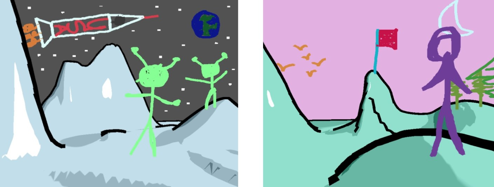

The culminating assignment in the course is inspired by the 1955 children's book, [Harold and the Purple Crayon](https://en.wikipedia.org/wiki/Harold_and_the_Purple_Crayon) by Crockett Johnson. Harold is a little boy who creates his own virtual worlds just by drawing them with his magical purple crayon. In this assignment, you will bring Harold's magic to your computer screen.

In addition to inspiring children for decades, Harold can also claim to have inspired some exciting early computer graphics research in non-photorealistic rendering. In this assignment, we will be implemented portions of the paper, [Harold: A World Made of Drawings](https://dl.acm.org/citation.cfm?id=340927), presented by Cohen et al. at ACM NPAR 2000, the 1st International Symposium on Non-Photorealistic Animation and Rendering.  If you like, you can watch a [video of the original system](https://mediaspace.umn.edu/media/t/1_gtj35asj). 

 The lead author of this paper, Jonathan Cohen, was about your age (a junior or senior in college) when he developed this system and published it as his first research paper. He then went on to work on movie special effects at Industrial Light and Magic. This is the kind of thing you may also be able to do if you continue studying computer graphics and get involved in the graphics, visualization, and virtual reality research groups in our department!

To work with this code, you will first need to install [Node.js 18.13.0 LTS](https://nodejs.org/) and [Visual Studio Code](https://code.visualstudio.com/). 

## Getting Started

```
npm install
```

This will create a `node_modules` folder in your directory and download all the dependencies needed to run the project.  Note that this folder is listed in the `.gitignore` file and should not be committed to your repository.  After that, you can compile and run a server with:

```
npm run start
```

Your program should open in a web browser automatically.  If not, you can run it by pointing your browser at `http://localhost:8080`.

## Background

The three main features in Harold are: 

1. Drawing hills and valleys on the ground.
2. Drawing strokes in the sky.
3. Drawing billboards, which allow the user to create strokes that show on top of the ground. 

Instead of implementing all three, you will just be implementing #1 and #2. The support code already contains a complete implementation of #3 for you.  Harold is a complete application, so there is quite a bit of support code provided for this assignment. Start by reading through the code, which is heavily commented, and learn how a computer graphics program like this is put together.

The `DrawingApp` class is the main application class and implements the sketch-based user interaction techniques. One of the things that is really cool about Harold is that the user input can be interpreted differently based upon the current content. The original Harold paper did include some drawing modes in order to support some extra features, but for our version, we do not need any buttons to turn on "draw on the sky mode" vs. "draw on the ground mode" vs. "create a billboard mode" – we just draw, and the system figures out our intent. Properties of the path drawn by the user's mouse (called the *stroke*) are used to trigger different 3D modeling operations, as shown in the following table:

| Stroke Made by Mouse                     | 3D Modeling Operation                            |
| ---------------------------------------- | ------------------------------------------------ |
| Starts in the sky                        | Add a new stroke to the sky                      |
| Starts AND ends on the ground            | Edit the ground mesh to create hills and valleys |
| Starts on the ground and ends in the sky | Create a new billboard                           |
| Starts on an existing billboard          | Add the stroke to the existing billboard         |

As the user draws a stroke, the application records the path of the mouse as a series of 2D points, which are stored in the `screenPath` array in the `Billboard` class. You’ll need to work with this array, which is of type `gfx.Vector2`, to implement some of the features.

We can’t draw the `screenPath` directly to the screen – it needs to be converted into triangles first. So, the `Billboard` class also contains a `Mesh`, along with arrays of its 3D vertices and indices. The vertices of the mesh follow the centerline of the `screenPath`, adding just a bit of thickness around it so that it can show up nicely on the screen. You will also need to work with this mesh to implement some of the features.

Please note, the 2D points and vertices stored in `screenPath` are not in pixel units.  Instead, they are in **normalized device coordinates**, where the top left corner of the screen is (-1, 1) and the bottom right is (1, -1).  You can think of this as the 2D equivalent of the **canonical view volume** that we discussed in class. This is convenient because it is the coordinate system that is needed when converting a point on the 2D projection plane to a point in 3D space, and it is the expected input for the `Ray` we will use to implement the 3D modeling operations.

## Acknowledgments

This assignment was based on content from CSCI 4611 Fall 2021 by [Daniel Keefe](https://www.danielkeefe.net/).

## License

Material for [CSCI 4611 Spring 2023](https://csci-4611-spring-2023.github.io/) by [Evan Suma Rosenberg](https://illusioneering.umn.edu/) is licensed under a [Creative Commons Attribution-NonCommercial-ShareAlike 4.0 International License](http://creativecommons.org/licenses/by-nc-sa/4.0/).

## License

Material for [CSCI 4611 Spring 2023](https://csci-4611-spring-2023.github.io/) by [Evan Suma Rosenberg](https://illusioneering.umn.edu/) is licensed under a [Creative Commons Attribution-NonCommercial-ShareAlike 4.0 International License](http://creativecommons.org/licenses/by-nc-sa/4.0/).
